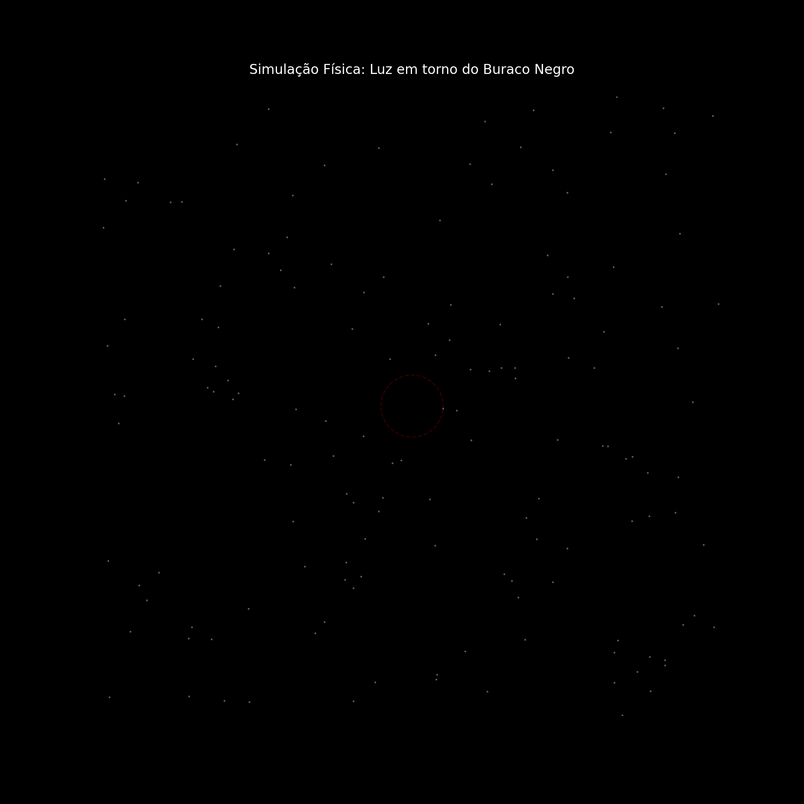
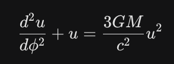

# Simulação de Trajetória da Luz em torno de um Buraco Negro

Esta simulação em Python utiliza a **Métrica de Schwarzschild** para demonstrar como a luz (fótons) se comporta ao passar perto de um buraco negro estático. O projeto visualiza fenômenos como a **Lente Gravitacional** e a **Esfera de Fótons** através de uma animação interativa.



-----

## 🚀 Visão Geral

O script resolve as equações geodésicas da Relatividade Geral para traçar a trajetória da luz no espaço-tempo curvo. Ao contrário da física clássica, onde a luz viaja em linha reta, aqui ela segue a curvatura do espaço gerada pela massa massiva do buraco negro.

### O que observar na animação:

  * **Raios Azuis:** Fótons que sofrem deflexão gravitacional, mas conseguem escapar para o infinito.
  * **Raios Laranjas:** Fótons que cruzam o horizonte de eventos e são capturados.
  * **Linha Tracejada Vermelha:** A **Esfera de Fótons** ($1.5 \times R_s$), a região limite onde a luz pode orbitar o buraco negro.
  * **Círculo Preto Central:** O **Horizonte de Eventos** ($R_s$), o ponto de não retorno.

-----

## 📖 A Física por trás

### 1\. A Luz sofre gravidade?

Na física de Newton, a gravidade é uma força entre massas. Como a luz não tem massa, ela deveria ser imune a ela.

**Einstein mudou isso:** Ele propôs que a gravidade é uma **curvatura no espaço-tempo**. Imagine uma cama elástica com uma bola de boliche no centro: se você rolar uma bolinha de gude, ela fará uma curva porque o "chão" por onde ela passa está deformado.

### 2\. A Métrica de Schwarzschild

Utilizamos o modelo de um buraco negro estático (sem rotação e sem carga). Para fins computacionais, trabalhamos com a variável **$u = 1/r$**.

  * **Por que usar $u$?** Quando a luz está muito longe (no infinito), $r = \infty$ e $u = 0$. Isso torna o cálculo matemático muito mais estável para o processador.

### 3\. A Equação Diferencial (O Coração da Lógica)

A trajetória é governada pela seguinte equação:



**Quebrando a fórmula:**

1.  **$\frac{d^2u}{d\phi^2}$**: A aceleração da curva (o desvio da linha reta).
2.  **$+ u$**: O componente que representaria uma linha reta no espaço plano.
3.  **$\frac{3GM}{c^2}u^2$**: O **Termo de Relatividade**. Quanto menor o raio ($r$), maior o valor de $u$, e exponencialmente maior a força que puxa a luz para o centro.

-----

## 💻 Implementação em Python

Aqui está o mapeamento dos conceitos físicos para o código:

### A. O Kernel de Cálculo (`deriv`)

Como o Python não resolve equações de segunda ordem nativamente, a quebramos em duas de primeira ordem dentro da função que alimenta o integrador:

```python
def deriv(u_phi, phi, rs):
    u, p = u_phi
    # p é a primeira derivada (velocidade da curva)
    dudphi = p 
    # A aceleração (segunda derivada) baseada na equação de Einstein
    dpdphi = 1.5 * rs * u**2 - u 
    return [dudphi, dpdphi]
```

*Nota: Simplificamos $\frac{3GM}{c^2}$ para `1.5 * rs` no código.*

### B. O Parâmetro de Impacto ($b$)

O $b$ é a distância perpendicular entre a trajetória da luz e o centro do buraco negro. Existe um valor crítico: se $b < 2.59 \times R_s$, a luz é inevitavelmente engolida.

```python
# p0 define a direção inicial do raio baseado no offset 'b'
p0 = -np.sqrt(np.abs(1.0/b**2 - (1.0 - rs/distancia_ini) * u0**2))
```

### C. Integração Numérica

O universo processa a posição da luz continuamente; o Python faz isso em "steps" usando o `odeint` (um solver de equações diferenciais):

```python
# Resolve a trajetória para um intervalo de ângulos (phi_span)
sol = odeint(deriv, [u0, p0], phi_span, args=(rs,))
```

-----

## 🛠️ Tecnologias Utilizadas

  * **NumPy:** Para manipulação eficiente de arrays de dados.
  * **SciPy (`odeint`):** Para resolver as equações geodésicas.
  * **Matplotlib:** Para a renderização gráfica e animação via `FuncAnimation`.

-----

## 🔧 Como rodar

1.  Certifique-se de ter o Python instalado.
2.  Instale as dependências: `uv add numpy scipy matplotlib pillow`.
3.  Execute o script e aguarde a geração do gráfico/GIF.

-----